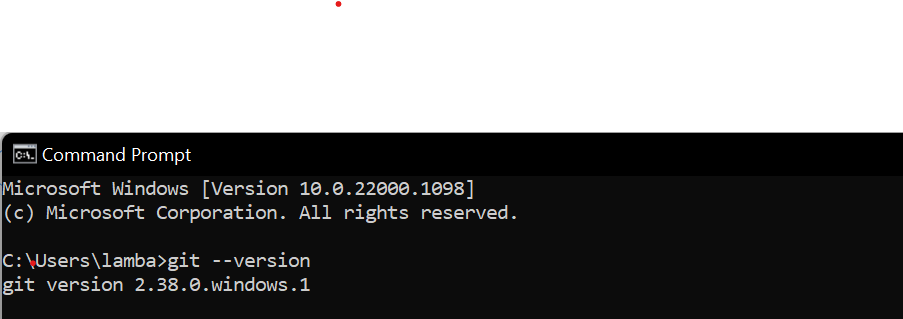
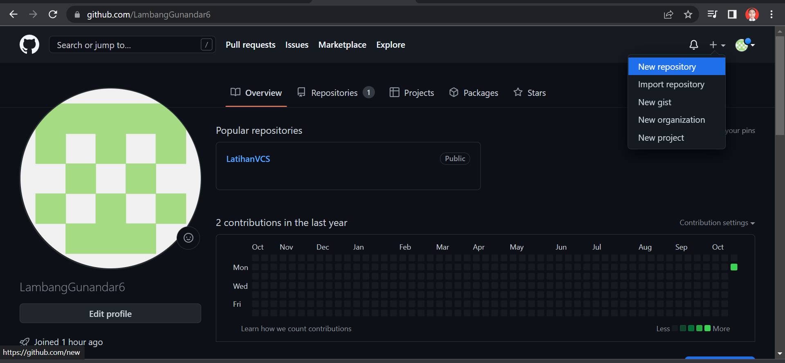
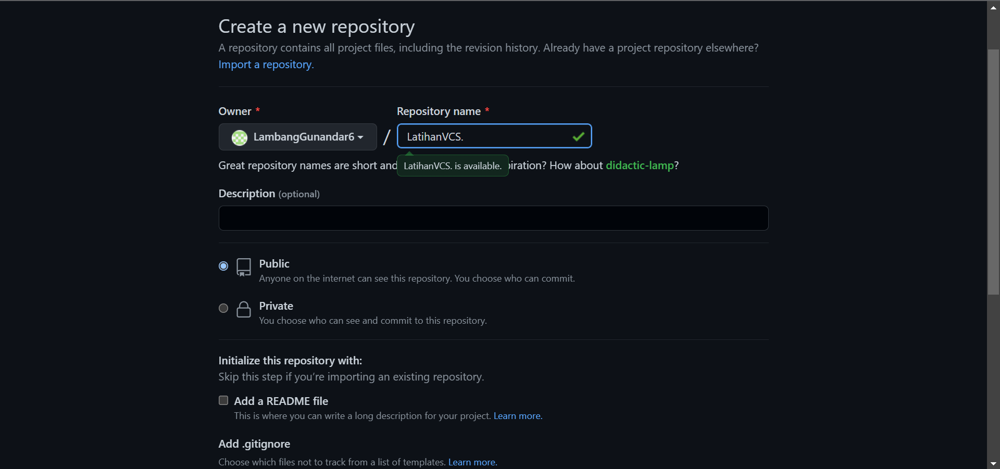
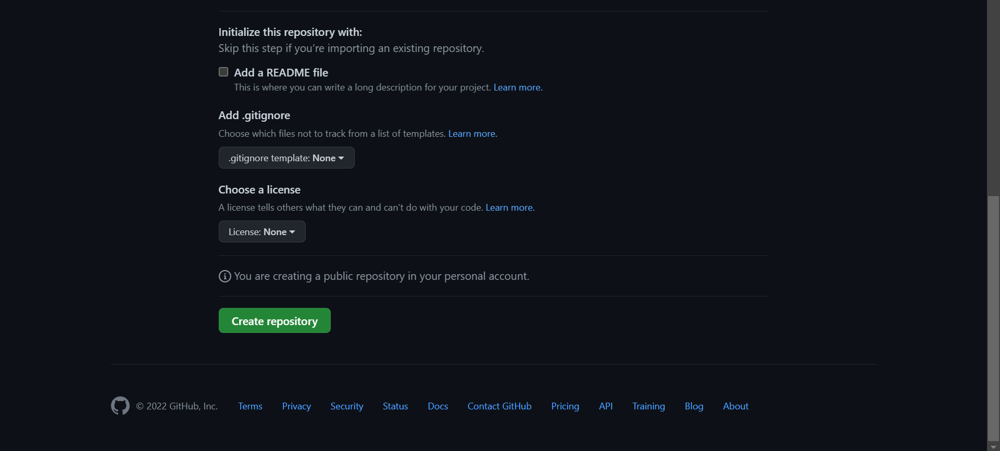

#Latihan 1
## Cara Instalasi dan Penggunaan Git

### Instalasi Git
 Download File Git
Untuk menginstall Git, Anda perlu mengunduh file-nya terlebih dahulu di situs resminya. Download sesuai tipe sistem operasi pada komputer Anda. Apabila tipe sistem operasi komputer Anda 64bit,  pilih Git yang mendukung Windows 64bit. Tujuannya adalah agar tidak terjadi error saat proses instalasi Git.

 Install Git
Setelah selesai mengunduh file Git, buka setup aplikasi Git untuk memulai proses instalasi. Halaman awal setelah Anda membuka setup aplikasi Git adalah tampilan Document License dari Git. Klik Next untuk melanjutkan instalasi.

Berikut ini adalah tampilan proses instalasi Git. Tunggu hingga proses selesai dan Anda bisa menggunakan Git pada Windows.

Cek Versi Git
Setelah proses instalasi selesai, Anda perlu mengecek apakah instalasi Git berhasil atau tidak.Selanjutnya masukkan perintah berikut untuk cek versi git dan cek apakah Git sudah terinstall di komputer Anda.

$ git --version

Jika Git berhasil terinstall, Anda akan melihat tampilan seperti di bawah ini yang menunjukkan versi Git. 

Membuat Reposiory Local

Buka direktory aktif, misal: d:\labs_pemrograman (buka
menggunakan Windows Explorer)
klik kanan pada direktory aktif tersebut, dan pilih menu Git Bash,
sehingga muncul git bash commad
Buat direktory project praktikum pertama dengan nama latihanpertama
Sehingga terbentuk satu direktori baru dibawahnya, selanjutnya
masuk kedalam direktori tersebut dengan perintah cd (change
directory)

$ mkdir latihanpertama

$ cd latihanpertama

direktory aktif menjadi: d:\labs_pemrograman1\latihanpertama

Membuat Reposiory Local

Jalankan perintah git init, untuk membuat repository local.

$ git init

Repository baru berhasil di inisialisasi, dengan terbentuknya satu
direktori hidden dengan nama .git Pada direktori tersebut, semua perubahan pada working directory
akan disimpan.

Menambahkan File baru pada repository

Untuk membuat file dapat menggunakan text editor, lalu menyimpan
filenya pada direktori aktif (repository) disini kita akan coba buat satu file bernama README.md (text file)
Menambahkan File baru pada repository Untuk menambahkan file yang baru saja dibuat tersebut gunakan
perintah git add.

$ echo “# Latihan 1” >> README.md
$ git add README.md

File README.md berhasil dibuat dan File README.md berhasil ditambahkan

Commit (Menyimpan perubahan ke database)

Untuk menyimpan perubahan yang ada kedalam database repository
local, gunakan perintah 

$ git commit -m “Commit Pertama”

Perubahan berhasil disimpan

Membuat repository server

• Server reopsitory yang akan kita gunakan adalah http://github.com. Anda harus membuat akun terlebih dahulu. Pada laman github, klik tombol start a project, atau Dari menu (icon +) klik New Repository

Membuat repository server

Isi nama repositorynya, misal: LatihanVCS

lalu klik tombol Create repository

Menambahkan Remote Repository

Remote Repository merupakan repository server yang akan
digunakan untuk menyimpan setiap perubahan pada local repository,
sehingga dapat diakses oleh banyak user. Untuk menambahkan remote repository server, gunakan perintah

$ git remote add origin https://github.com/abuazzam/labpy1.git

Push (Mengirim perubahan ke server)

Untuk mengirim perubahan pada local repository ke server gunakan
perintah git push. Perintah ini akan meminta memasukkan username dan password
pada akun github.com

$ git push -u origin master

Melihat hasilnya pada server repository

Buka laman github.com, arahkan pada repositori-nya.

Maka perubahan akan terlihat pada laman tersebut.

srdtfyg8h9j
